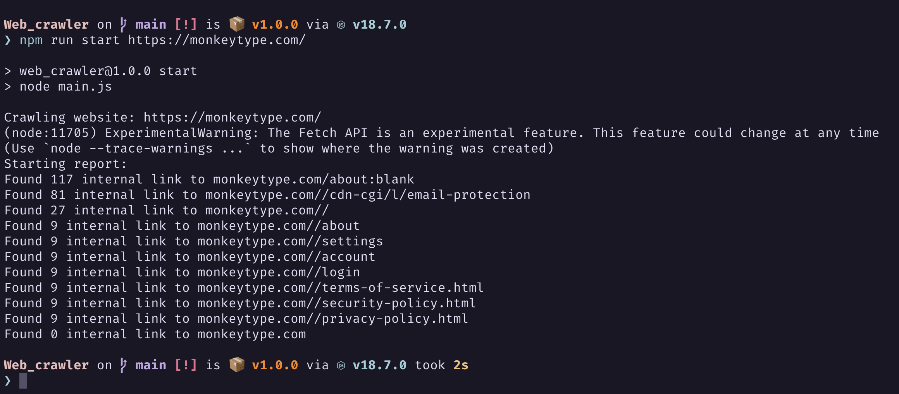

# The SEO tools of your dream !

A little nodejs script who list subdomain of given website and print report about it




## Requirements

**node >= 18**


## Installation

```bash
git clone git@github.com:macrespo42/Web_crawler.git
cd Web_crawler
npm install
```

## Usage

```bash
npm run start $url_of_the_website_to_crawl$
```

## Tests

Unit test provided with the project you can run it using:

```bash
npm run test
```
